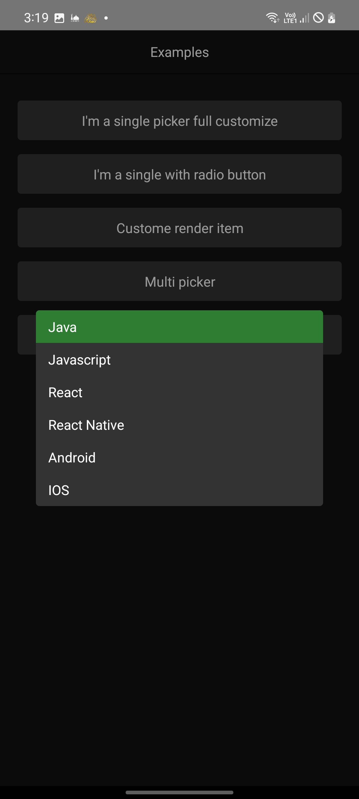

# react-native-single-multi-select-fully-customized

Simple single or multi select picker create to by fully costmoized as a modal for any use of picker. Its support (mutil theme, Checkbox, RadioButton) by using react-native-paper ( Thanks a lot ).

## Screenshots

| Examples | single picker full customize | render item example | Custome label and value | multi picker | single picker
| --- | --- | --- | --- | --- | --- |
|  |  |  |  | | 

## Installation

```sh
npm install react-native-single-multi-select-fully-customized react-native-paper
```

## Usage

### See example for more details and more examples

```js
import React, { useState } from 'react';
import { View, ScrollView, Text, Pressable, Image } from 'react-native';
import { useTheme } from 'react-native-paper';
import { CustomizePicker } from 'react-native-single-multi-select-fully-customized';
import CustomeText from './components/CustomeText';

const DUMMY_ITEMS_1 = [
  { label: 'Red', color: '#CE4C4E', value: '#CE4C4E' },
  { label: 'Orange', color: '#FFA200', value: '#FFA200' },
  { label: 'Yellow', color: '#FFE001', value: '#FFE001' },
  { label: 'Green', color: '#6FC330', value: '#6FC330' },
  { label: 'Blue', color: '#0070CE', value: '#0070CE' },
  { label: 'Purple', color: '#7B35BC', value: '#7B35BC' },
  { label: 'White', color: '#ffffff', value: '#ffffff' },
  { label: 'Black', color: '#000000', value: '#000000' },
  { label: 'Gray', color: '#696969', value: '#696969' },
];

const DUMMY_ITEMS = [
  { name: 'Java', id: 1 },
  { name: 'Javascript', id: 2 },
  { name: 'React', id: 3 },
  { name: 'React Native', id: 4 },
  { name: 'Android', id: 5 },
  { name: 'IOS', id: 6 },
];
export default function Examples() {
  const [selectedValue, setSelectedValue] = useState(DUMMY_ITEMS_1[0].value);
  const [showCustomePicker, setShowCustomePicker] = useState(false);
  const { colors } = useTheme();
  const [multiPickerValue, setMultiValues] = useState<any>([
    DUMMY_ITEMS_1[0].value,
  ]);
  return (
    <View style={[{ flex: 1, backgroundColor: colors.background }]}>
      <CustomeText
        style={{
          textAlign: 'center',
          padding: 14,
          borderBottomColor: colors.backdrop,
          borderBottomWidth: 1,
          marginBottom: 10,
        }}
      >
        Examples
      </CustomeText>
      <ScrollView style={{ paddingHorizontal: 20, paddingTop: 20 }}>
        <CustomizePicker
          visible={showCustomePicker}
          onRequestClose={() => setShowCustomePicker(false)}
          key={'single'}
          items={DUMMY_ITEMS_1}
          onItemPress={(item) => setSelectedValue(item.value)}
          selectedValue={selectedValue}
          placeholder={"I'm a single picker full customize"}
          containerPlaceholderStyle={{
            backgroundColor: '#333',
            marginBottom: 16,
          }}
          placeholderOnpress={() => setShowCustomePicker(true)}
          isTopBar={true}
          overlayStyle={{ paddingHorizontal: 0 }}
          containerStyle={{ maxHeight: '100%', height: '100%' }}
          renderFooter={() => (
            <Pressable
              onPress={() => setShowCustomePicker(false)}
              style={{
                padding: 4,
                backgroundColor: '#333',
                marginTop: 50,
                marginHorizontal: '10%',
                borderRadius: 4,
              }}
            >
              <Text style={{ color: '#ddd', textAlign: 'center' }}>
                Close Me
              </Text>
            </Pressable>
          )}
          renderItemLeft={(item) => (
            <View
              style={{
                width: 25,
                backgroundColor: item?.color || '#345',
                height: '100%',
              }}
            ></View>
          )}
          itemLabelStyle={{ paddingHorizontal: 16 }}
          closeIcon={
            <Image
              source={require('./assets/icons8-back-48.png')}
              style={{ width: 36, height: 36, backgroundColor: '#ddd' }}
              resizeMode="center"
            />
          }
          searchIcon={
            <Image
              source={require('./assets/icons8-search-48.png')}
              style={{ width: 36, height: 36, backgroundColor: '#ddd' }}
              resizeMode="center"
            />
          }
          closeSearchIcon={
            <Image
              source={require('./assets/icons8-close-48.png')}
              style={{ maxWidth: 36, maxHeight: 36, backgroundColor: '#ddd' }}
              resizeMode="center"
            />
          }
        />
        <CustomizePicker
          key={'single withh radio button'}
          items={DUMMY_ITEMS_1}
          onItemPress={(item) => setSelectedValue(item.value)}
          selectedValue={selectedValue}
          placeholder={"I'm a single with radio button"}
          containerPlaceholderStyle={{
            backgroundColor: '#333',
            marginBottom: 16,
          }}
          showRadioButton={false}
        />
        <CustomizePicker
          key={'custome render item'}
          items={DUMMY_ITEMS_1}
          onItemPress={(item) => setSelectedValue(item.value)}
          selectedValue={selectedValue}
          placeholder={'Custome render item'}
          containerPlaceholderStyle={{
            backgroundColor: '#333',
            marginBottom: 16,
          }}
          renderItem={(item) => (
            <Pressable
              key={item.value}
              onPress={() => console.log('render item: ', item)}
            >
              <Text style={{ padding: 8, color: colors.text }}>
                {item.label}
              </Text>
            </Pressable>
          )}
        />
        <CustomizePicker
          key={'multi'}
          items={DUMMY_ITEMS_1}
          onItemPress={(item) => {
            const findIndex = multiPickerValue?.indexOf(item.value);
            if (findIndex > -1)
              setMultiValues(
                multiPickerValue.filter((value: any) => value !== item.value)
              );
            else
              setMultiValues([...new Set([...multiPickerValue, item.value])]);
          }}
          selectedValue={multiPickerValue}
          placeholder={'Multi picker'}
          isMultiPick={true}
          showRadioButton={false}
          isBackAfterPick={false}
          containerPlaceholderStyle={{
            backgroundColor: '#333',
            marginBottom: 16,
          }}
        />
        <CustomizePicker
          key={'custome label and value'}
          items={DUMMY_ITEMS}
          onItemPress={(item, index) => {
            console.log('item: ', item, ',index: ', index);
          }}
          selectedValue={DUMMY_ITEMS[0].id}
          placeholder={'Custome label and value'}
          getLabel={(item) => item.name}
          getValue={(item) => item.id}
          containerPlaceholderStyle={{ backgroundColor: '#333' }}
          containerStyle={{ backgroundColor: '#333' }}
        />
      </ScrollView>
    </View>
  );
}

```


## API Refer
### Props

#### for Placeholder
| Prop | Type | Required | Description | Default value |
| :-------- | :------- | :-------- | :------- |:-------- |
| placeholder | string | no | button placeholder text to open picker | Pick item... |
| containerPlaceholderStyle | ViewStyleProp | no | style for placeholder view | undefined |
| placeholderStyle | TextStyleProp | no | style for placeholder text | undefined |
| renderPlaceholder | functional components  | no | custome render for placeholder component | undefined |
| placeholderOnpress | function | no | custome on press function | function to show picker |

#### for Container 

| Prop | Type | Required | Description | Default value |
| :-------- | :------- | :-------- | :------- |:-------- |
| visible | boolean | no | as react native modal  | undefined |
| onRequestClose | function | no | as react native modal (require with visible) | - |
| transparent | boolean | no | as react native modal | true |
| animationType | string | no | as react native modal | slide |
| overlayStyle | StyleProp | no | style for overlay modal | - |
| containerStyle | StyleProp | no | style for container inside overlay | - |

#### For Topbar and search 
| Prop | Type | Required | Description | Default value |
| :-------- | :------- | :-------- | :------- |:-------- |
| isTopBar | boolean | no | hide or show topbar | false |
| renderTopBar | functional component | no | custome render topbar component | undefined |
| closeIcon | JSX Element | no | render custome close icon in topbar | undefined |
| showSearch | boolean | no | hide or show search | false |
| topbarStyle | ViewStyleProp | no | custome style for topbar | undefined |
| title | string | no | custome title picker | undefined |
| titleStyle | TextStyleProp | no | custome title style | undefined |
| searchValue | string | no | search textInput value | "" |
| setSearchValue | function | no | custome search textInput onChangeText function  | undefined |
| searchPlaceholder | string | no | custome search placeholder text  | Type something... |
| searchIcon | JSX Element | no | custome search icon | undefined |
| closeSearchIcon | JSX Element | no | custome close search icon | undefined |
| searchInputProps | TextInputProps | no | override search TextInput props  | undefined |

#### For Item
| Prop | Type | Required | Description | Default value | Parameters |
| :-------- | :------- | :-------- | :------- |:-------- | :-------- |
| items | array | no | items to display in list | [] | - |
| renderItems | functional component | no | custome render items| undefined | items |
| renderItem | functional component | no | custome render item | undefined | item |
| renderItemRight | functional component | no | custome component in right of item | undefined | item |
| renderItemLeft | functional component | no | custome component in left of item | undefined | item |
| checkboxProps | react native paper checkboxProps | no | override checkbox props react-native-paper | undefined | - |
| radioButtonProps | react native paper radioButtonProps | no | override radioButton props | undefined | - |
| itemStyle | ViewStyleProp | no | custome item style | undefined | - |
| itemLabelStyle | TextStyleProp | no | custome item label style | undefined | - |
| itemActiveStyle | ViewStyleProp | no | custome item style if active | undefined | - |
| itemActiveLabelStyle | TextStyleProp | no | custome item label style if active | undefined | - |
| onItemPress | function | no | call when item press | undefined | (item, index) |
| isBackAfterPick | boolean | no | determine closing picker after pick | true | - |
| selectedValue | any | no | Value matching value of one of the items. Can be a string, an integer or array of values `isMultiPicker = true`. | undefined | - |
| isMultiPick | boolean | no | determine if multi picker  | false | - |
| showCheckbox | boolean | no | determine hiding checkbox in multi picker mode | false | - |
| showRadioButton | boolean | no | determine showing radio button | true | - |
| getLabel | function | no | function to return the item text to be displayed or searching for. | (item)=> item.label | (item) |
| getValue | function | no | function to return the item value to be used as a key. | (item)=> item.value | (item) |

#### For Footer
| Prop | Type | Required | Description | Default value |
| :-------- | :------- | :-------- | :------- |:-------- |
| renderFooter | functional component | no | render custome footer | undefined |

## Contributing

See the [contributing guide](CONTRIBUTING.md) to learn how to contribute to the repository and the development workflow.

## License

MIT

## Support

For support, email hossambasha9900@gmail.com.

hint: 
Hi there, 

It's my first package.
I hope to contact me i you have any issue, have a feedback or any suggestion to optimize package or my skills too :). 


